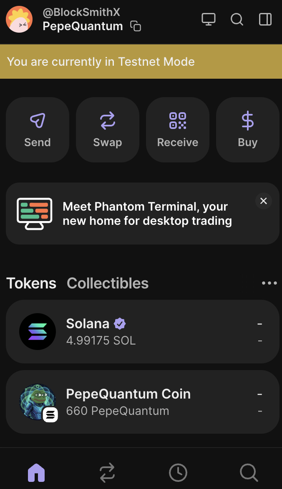
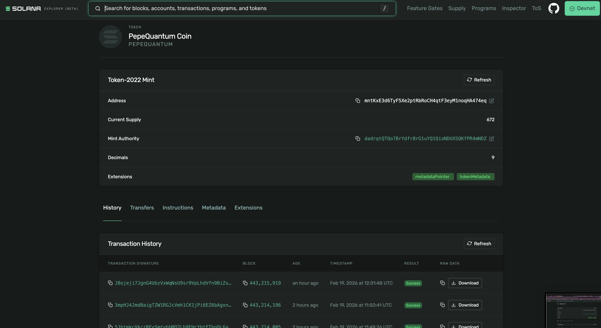

# 🚀 PepeQuantum (PEPQ)

Quantum-inspired SPL token deployed on Solana Devnet.

---

## 🔗 Network
Solana Devnet

## 📌 Token Details

- Name: PepeQuantum
- Symbol: PEPQ
- Standard: SPL Token
- Network: Devnet
- Decimals: 9

---

## 🛠 Creation Process

solana config set --url devnet
spl-token create-token
spl-token create-account <dadrqtQTQo7BrYdfr8rG1uYQ1QisNDUXSQKfPR4mNDZ>
spl-token mint <mntKxE3d6TyF5Xe2ptRbRoCH4qtF3eyM1noqHA474eq> 672

---

## 🧱 Architecture

- Solana CLI
- SPL Token Program
- IPFS Metadata
- Dockerized Environment

---

## 🔐 Security

- Private keys excluded from repository
- Devnet deployment
- Metadata hosted on IPFS

---

## 🗺 Roadmap

- Devnet Launch ✅
- Metadata Hosting ✅
- GitHub Repository ✅
- Mainnet Deployment ⏳

---

## 📄 License

MIT

---

---

---
